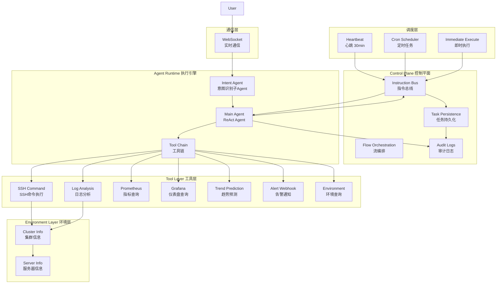

# AIOPS - Intelligent Operations Agent

基于 LangChain 的智能运维 Agent 系统，支持通过指令总线动态下发巡检任务，具备心跳自检、定时 Cron、即时执行三种调度模式，同时支持用户交互式指令输入和智能意图识别。

## 架构图



## 核心特性

- **三层调度模式**：心跳自检 (30分钟) + Cron 定时 + 即时执行
- **指令总线**：StarRocks 持久化，支持状态机 (pending→running→completed/failed)
- **会话隔离**：巡检任务独立 Session，用户交互保持上下文
- **车道锁**：同一目标服务器串行执行，防止 SSH 并发风暴
- **意图识别**：多轮对话槽位填充，智能识别用户意图
- **LangGraph**：主 Agent (observe→analyze→predict→decide→act→report)

## 快速开始

### 前置要求

- Python 3.11+
- StarRocks (或 MySQL 兼容数据库)
- OpenAI API Key (或其他 LLM)

### 本地运行

1. 安装依赖

```bash
pip install -r requirements.txt
```

2. 配置环境变量

```bash
# 创建 .env 文件
cp .env.example .env

# 编辑 .env 文件，配置以下内容
DATABASE__HOST=localhost
DATABASE__PORT=9030
DATABASE__USER=root
DATABASE__PASSWORD=

LLM__PROVIDER=openai
LLM__API_KEY=your-api-key
LLM__MODEL=gpt-4
```

3. 启动应用

```bash
python src/main.py
```

### Docker 运行

```bash
cd docker
docker-compose up -d
```

## 配置说明

### 环境变量

| 变量 | 说明 | 默认值 |
|------|------|--------|
| `DATABASE__HOST` | StarRocks 主机 | localhost |
| `DATABASE__PORT` | StarRocks 端口 | 9030 |
| `DATABASE__USER` | 数据库用户 | root |
| `DATABASE__PASSWORD` | 数据库密码 | - |
| `LLM__PROVIDER` | LLM 提供商 | openai |
| `LLM__API_KEY` | API Key | - |
| `LLM__MODEL` | 模型名称 | gpt-4 |
| `PROMETHEUS__URL` | Prometheus URL | http://localhost:9090 |
| `GRAFANA__URL` | Grafana URL | http://localhost:3000 |
| `WEBSOCKET__PORT` | WebSocket 端口 | 8765 |
| `SCHEDULER__HEARTBEAT_INTERVAL` | 心跳间隔(秒) | 1800 |

## API 使用

### WebSocket API

连接 `ws://localhost:8765`

#### 发布巡检指令

```json
{
  "type": "command",
  "action": "run_now",
  "name": "CPU Check",
  "targets": ["192.168.1.1"],
  "inspection_items": [
    {"check_type": "cpu", "threshold": "80"}
  ]
}
```

#### 用户查询

```json
{
  "type": "user_query",
  "content": "查看 CPU"
}
```

## 工具列表

| 工具 | 说明 |
|------|------|
| `ssh_command` | SSH 远程命令执行 |
| `log_analysis` | 日志分析，支持正则和异常检测 |
| `prometheus_query` | Prometheus 指标查询 |
| `grafana_query` | Grafana 仪表盘查询 |
| `trend_prediction` | 基于历史数据的趋势预测 |
| `alert_webhook` | 告警通知 |
| `environment_query` | 环境信息查询 |

## 测试

```bash
# 运行所有测试
pytest tests/ -v

# 运行单个测试
pytest tests/test_aiops.py::TestModels -v
```

## 项目结构

```
AIOPS/
├── src/
│   ├── models/          # 数据模型 (Pydantic)
│   ├── config/          # 配置管理
│   ├── db/              # 数据库层 (StarRocks)
│   ├── environment/     # 环境信息管理
│   ├── tools/           # 工具层 (7个工具)
│   ├── bus/             # 指令总线
│   ├── agent/           # Agent (主 Agent + 意图识别)
│   ├── scheduler/       # 调度器
│   ├── services/        # 服务 (心跳、审计、WebSocket)
│   └── main.py          # 主入口
├── tests/               # 测试用例
├── docker/              # Docker 配置
├── CLAUDE.md            # Claude Code 指南
└── requirements.txt     # 依赖
```

## License

MIT